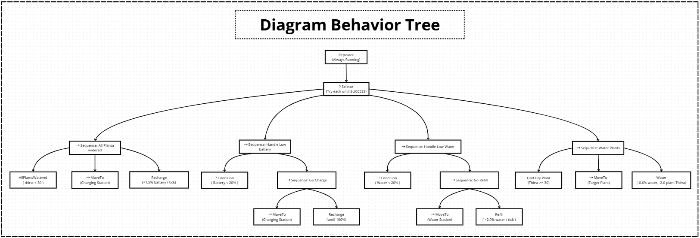

# BT Implementation Pygame

This repository contains an implementation of a **Behavior Tree (BT)** model simulated using **Pygame**.  
In this simulation, a robot is designed to **water plants automatically**. The Behavior Tree controls the robot’s actions, including watering plants, recharging its battery, refilling its water tank, and handling other behaviors dynamically based on environmental conditions.

A visual diagram of the Behavior Tree model is included in this project to illustrate how each node interacts within the decision-making structure.



---

## Installation

Before running the code, make sure to install **Pygame** by executing the following command:

```bash
pip install pygame
```

## running

run code dengan run
```
python3 main.py
```

## Simulation Preview

Below is the preview of the simulation window when running the program:
